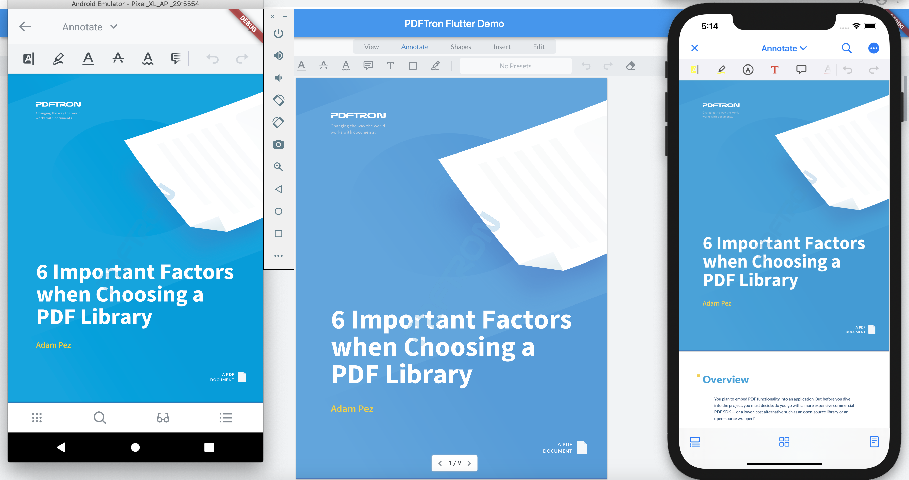

# Flutter - Web & Mobile Sample

This repo is specifically designed for any users interested in applying PDFTron SDK to Flutter in both web and mobile.



## Initial setup

Before you begin, make sure your development environment has setup based on the official documentation: [install](https://flutter.dev/docs/get-started/install) and [building a web application with Flutter](https://flutter.dev/docs/get-started/web).

## Steps

### Web

1. [Download](https://www.pdftron.com/documentation/web/download/web/) and unzip the WebViewer package, then place it in the root folder.

2. Run (install [Google Chrome](https://www.google.com/chrome/) if you have not):
```
flutter run
```

### Android

1. Run to check if you have a usable Android device:
```
flutter devices
```
If none are available, check this [site](https://flutter.dev/docs/get-started/install) for further instructions.

2. Run:
```
flutter run
```

### iOS

1. Run to check if you have a usable iOS device:
```
flutter devices
```
If none are available, check this [site](https://flutter.dev/docs/get-started/install) for further instructions.

2. Run:
```
flutter run
```

## Guides

- https://www.pdftron.com/documentation/web
- https://www.pdftron.com/documentation/ios
- https://www.pdftron.com/documentation/android

## APIs

### web

See [WebViewer API documentation](https://www.pdftron.com/documentation/web/guides/ui/apis).

### mobile

See [Flutter API documentation](https://github.com/PDFTron/pdftron-flutter#apis).

## Contributing

See [contributing](./CONTRIBUTING.md).

## License

See [license](./LICENSE).

